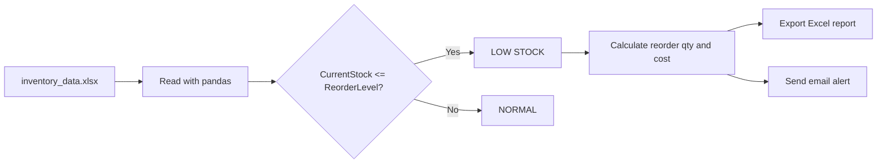

<div align="center">

# 📦 Low Stock Alert Automation

**Automated inventory monitoring that detects low-stock products, calculates reorder quantity and cost, and sends alerts by email.**


</div>

---

## 📑 Table of Contents

- [Overview](#-overview)
- [Features](#-features)
- [How It Works](#-how-it-works)
- [Business Logic](#-business-logic)
- [Tech Stack](#-tech-stack)
- [Project Structure](#-project-structure)
- [Getting Started](#-getting-started)
- [Usage](#-usage)
- [Sample Output](#-sample-output)
- [Screenshots](#-screenshots)
- [Roadmap](#-roadmap)
- [Author](#-author)

---

## 🎯 Overview

Manual stock checking is slow and error-prone, and stockouts lead to lost sales. This project automates the process end to end:

1. Reads inventory data from an Excel file
2. Flags products at or below their reorder level
3. Calculates how much to reorder and what it will cost
4. Exports a ready-to-use Excel report
5. Sends an email alert so the right person can act immediately

---

## ✨ Features

- 📊 **Excel integration**: reads inventory data and exports the report with pandas
- 🚨 **Smart detection**: flags products where `CurrentStock <= ReorderLevel`
- 🧮 **Reorder calculation**: computes target stock, reorder quantity, and reorder cost
- 📁 **Automated reporting**: generates `low_stock_report.xlsx`
- 🖥️ **Terminal alerts**: prints a formatted summary on every run
- 📧 **Email notifications**: sends alerts through Gmail SMTP
- 🔐 **Secure configuration**: credentials are loaded from environment variables

---

## 🔄 How It Works



---

## 🧠 Business Logic

| Metric | Formula |
|---|---|
| **Status** | `LOW STOCK` if `CurrentStock <= ReorderLevel`, else `NORMAL` |
| **Target Stock** | `ReorderLevel × 2` |
| **Reorder Quantity** | `max(TargetStock − CurrentStock, 0)` |
| **Reorder Cost** | `ReorderQuantity × UnitCost` |

---

## 🛠️ Tech Stack

| Tool | Purpose |
|---|---|
| Python 3.9+ | Core language |
| pandas | Data processing and calculations |
| openpyxl | Excel read/write engine |
| smtplib | Sending email through Gmail SMTP |

---

## 📂 Project Structure

```
Low-Stock-Alert-Automation/
├── data/
│   └── inventory_data.xlsx      # Input inventory data
├── output/
│   └── low_stock_report.xlsx    # Generated report
├── screenshots/                 # Project screenshots
├── low_stock_alert.py           # Main script
├── requirements.txt
├── .gitignore
└── README.md
```

### Input data format

`data/inventory_data.xlsx` must contain these columns:

| ProductID | Product | Category | CurrentStock | ReorderLevel | UnitCost | Supplier |
|---|---|---|---|---|---|---|

---

## 🚀 Getting Started

### 1. Clone the repository

```bash
git clone https://github.com/<your-username>/Low-Stock-Alert-Automation.git
cd Low-Stock-Alert-Automation
```

### 2. Install dependencies

```bash
pip install -r requirements.txt
```

### 3. Create a Gmail App Password

Google Account → Security → 2-Step Verification → App passwords.

### 4. Set environment variables

**Windows (PowerShell)**
```powershell
$env:SENDER_EMAIL="your_email@gmail.com"
$env:RECEIVER_EMAIL="receiver@gmail.com"
$env:EMAIL_PASSWORD="your_16_character_app_password"
```

**macOS / Linux**
```bash
export SENDER_EMAIL="your_email@gmail.com"
export RECEIVER_EMAIL="receiver@gmail.com"
export EMAIL_PASSWORD="your_16_character_app_password"
```

> ⚠️ Never commit your App Password to GitHub.

### 5. Add your data

Place your inventory file in `data/` and make sure the `output/` folder exists.

---

## ▶️ Usage

```bash
python low_stock_alert.py
```

On each run the script reads the inventory, saves `output/low_stock_report.xlsx`, prints the alert in the terminal, and sends an email if any product is low on stock.

---

## 📋 Sample Output

```
=============================================
 LOW STOCK ALERT
=============================================
LOW STOCK ALERT

- Product A → 5 remaining (Reorder Level: 20) | Order Qty: 35 | Cost: $175.00
- Product B → 12 remaining (Reorder Level: 15) | Order Qty: 18 | Cost: $90.00

=============================================
2 products require replenishment.
=============================================
```

---

## 📸 Screenshots

| Terminal Output | Email Alert | Excel Report |
|:---:|:---:|:---:|
|  |  |  |

---

## 🗺️ Roadmap

- [ ] Schedule daily runs (Windows Task Scheduler / cron)
- [ ] Attach the Excel report to the email
- [ ] Group alerts by supplier
- [ ] Add a Power BI inventory dashboard
- [ ] Add Telegram / WhatsApp notifications

---

## 👤 Author

**Lukesh M**
B.Tech Artificial Intelligence and Data Science | Aspiring Business Analyst & Data Analyst

[](https://github.com/<your-username>)
[](https://linkedin.com/in/<your-profile>)

---

<div align="center">

⭐ If you found this project useful, consider giving it a star.

</div>
